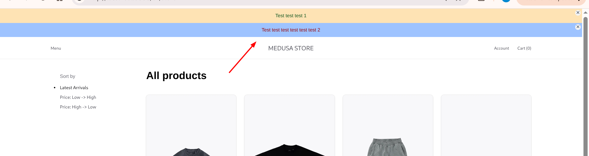
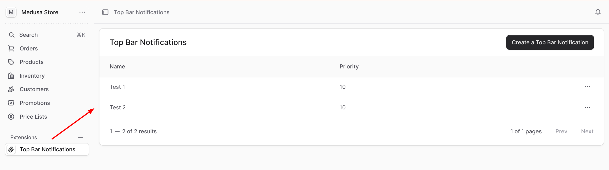

# Top Bar Notification component for the MedusaJS Starter Storefront

**Top Bar Notification storefront** is a component for MedusaJS Starter Storefront (Next.js Starter Storefront) which is provided with the MedusaJS plugin https://www.npmjs.com/package/@magenable/medusa-plugin-top-bar-notification.

## Installation

**Note:** it is required to install the following plugin https://www.npmjs.com/package/@magenable/medusa-plugin-top-bar-notification for your MedusaJS project

1. Install the following plugin for MedusaJS Starter Storefront (Next.js Starter Storefront) and 
```
npm install @magenable/medusa-plugin-top-bar-notification-storefront
```

2. Run the following **npx** command:

```
npx @magenable/medusa-plugin-top-bar-notification-storefront
```

## Upgrade

```
npm update @magenable/medusa-plugin-top-bar-notification-storefront
```

## Storefront view:



## Admin UI



#### About developer
The component is developed by Magenable (https://magenable.com.au), eCommerce consultancy specializing in Magento/Adobe Commerce based in Melbourne, Australia
